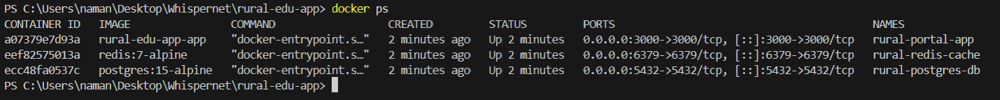
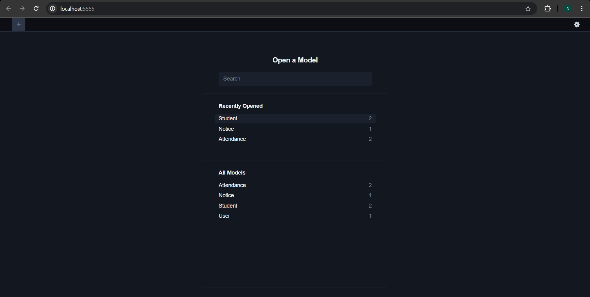
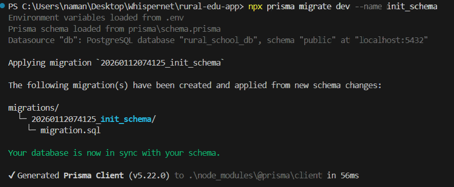
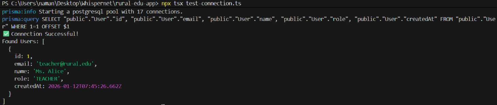
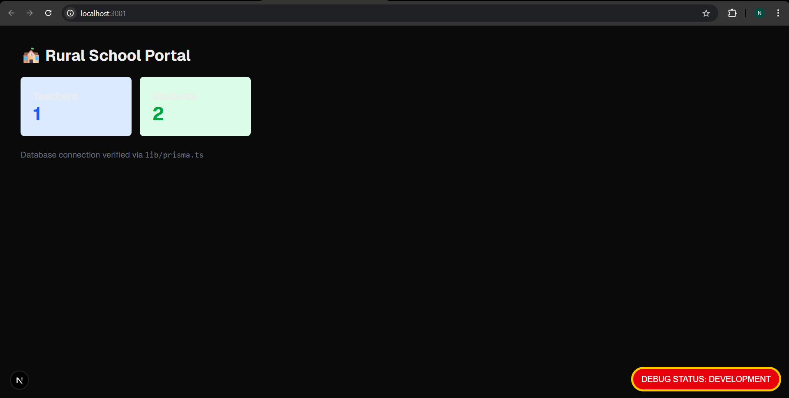
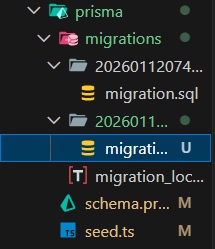
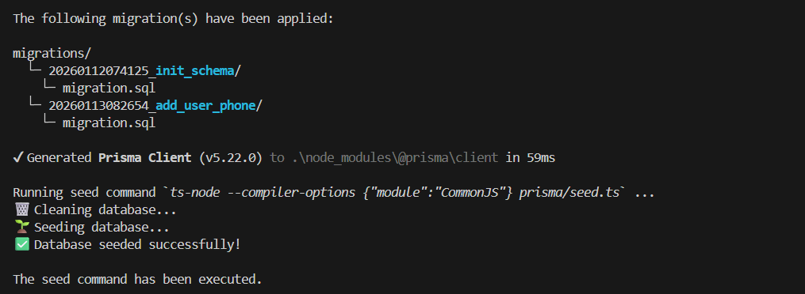
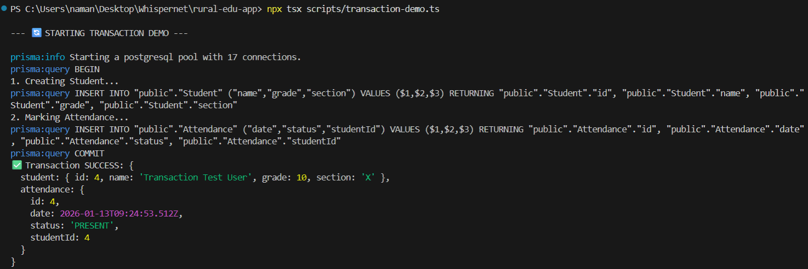
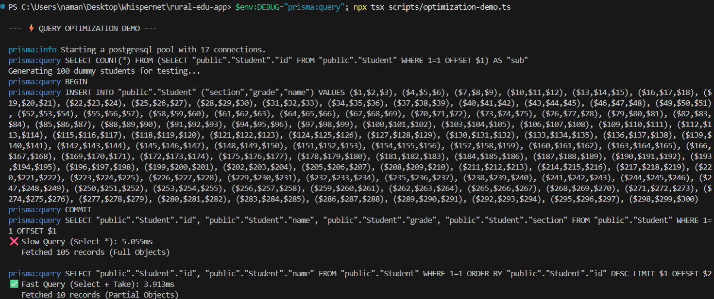

# Rural Education App - Offline-First Rendering Demo

## Problem Statement
Rural schools struggle with low bandwidth. This app demonstrates how Next.js rendering modes can optimize performance for these environments.

## Rendering Strategies Implemented

### 1. Static Site Generation (SSG) - /textbooks
* **Why:** Textbooks are static content.
* **Performance:** Pre-rendered HTML means zero server wait time and easy caching for offline use.

### 2. Server-Side Rendering (SSR) - /dashboard
* **Why:** Teachers need real-time attendance data.
* **Trade-off:** Slower TTFB (Time to First Byte) but ensures data accuracy.

### 3. Incremental Static Regeneration (ISR) - /notices
* **Why:** Notices change daily, not second-by-second.
* **Benefit:** Reduces server load by 99% compared to SSR, while keeping content relatively fresh.

## Build Evidence
Insert Screenshot of your `npm run build` terminal output here

---

# 🛠️ Code Quality & Configuration

To ensure our team writes clean, bug-free code, we have implemented strict linting and formatting rules.

## 1. TypeScript Configuration (`tsconfig.json`)
We enabled `strict: true`, `noImplicitAny`, and `noUnusedLocals`.
* **Why:** This prevents "undefined" errors at runtime and forces us to handle data types explicitly.

## 2. ESLint + Prettier
* **Style:** Double quotes, semi-colons required, tab width 2.
* **Quality:** No unused variables, warnings on `console.log`.
* **Why:** Ensures the code looks like it was written by one person, even with a team of 10.

## 3. Husky (Pre-Commit Hooks)
We use `lint-staged` to run checks before every commit.
* **Workflow:** If a developer tries to commit code with errors, the commit is blocked automatically.

# 🔐 Environment Variable Management

To ensure security, this project separates server secrets from client configuration.

## Setup Instructions
1. Copy the example file: `cp .env.example .env.local`
2. Fill in the real values in `.env.local`.

## Variable Reference

| Variable | Scope | Purpose |
| :--- | :--- | :--- |
| `DATABASE_URL` | **Server Only** | Connection string for PostgreSQL. Never exposed to browser. |
| `API_SECRET_KEY` | **Server Only** | Private key for backend services. |
| `NEXT_PUBLIC_APP_NAME` | **Client & Server** | The public display name of the app. |
| `NEXT_PUBLIC_API_BASE_URL` | **Client & Server** | Base URL for fetching data. |

## Security Measures
* **.gitignore:** Configured to ignore `.env.local` so secrets are never pushed to GitHub.
* **Prefixing:** Only variables starting with `NEXT_PUBLIC_` are bundled to the client.

## Reflection
If this app scaled to 10x users, I would move the **Teacher Dashboard** from pure SSR to Client-Side Fetching (SWR/TanStack Query) or aggressive caching to prevent the server from crashing under load.

---

# Concept 3: Cloud Deployments & Docker

## 1. Containerization (Docker)
I Dockerized the Rural School Portal to ensure it runs consistently across any environment.
* **Optimization:** Used a "Multi-Stage Build" in the Dockerfile to reduce the final image size.
* **Security:** Ran the container as a non-root user (`nextjs`) to prevent vulnerability escalation.

## 2. CI/CD Pipeline (GitHub Actions)
I set up an automated pipeline that triggers on every push.
* **Steps:** It installs dependencies, lints the code for errors, builds the Next.js app, and verifies the Docker build.
* **Benefit:** This prevents broken code from ever reaching the "production" branch.

## 3. Cloud Deployment Strategy (AWS)
*Architecture Plan:*  
For a production deployment to AWS, I would use **AWS App Runner** or **ECS (Elastic Container Service)**.
1. **Registry:** Push the Docker image to AWS ECR (Elastic Container Registry).
2. **Service:** Connect App Runner to ECR.
3. **Automation:** Update the GitHub Action to push the new image to AWS automatically on a successful build.

## Evidence
[Insert Screenshot of your Terminal running the Docker Container]  
[Insert Screenshot of the "Green" GitHub Actions run]   

# 🐳 Docker & Compose Setup

I have containerized the entire application stack to ensure consistency across development environments.

## Services Configured
1.  **App (`rural-portal-app`):** The Next.js application built using a multi-stage Dockerfile.
2.  **Database (`rural-postgres-db`):** PostgreSQL 15 running on port 5432.
3.  **Cache (`rural-redis-cache`):** Redis 7 running on port 6379.

## Networking
All services share a custom bridge network called `rural_network`.
* The app connects to the DB via the hostname: `db`
* The app connects to Redis via the hostname: `redis`

## How to Run
1.  Ensure Docker Desktop is running.
2.  Run the command:
    ```bash
    docker-compose up --build
    ```
3.  Access the app at `http://localhost:3000`.

## Evidence


# 🗄️ Database Schema & Design

I designed a normalized PostgreSQL schema using Prisma to ensure data integrity and scalability.

## Entity Relationship Diagram (ERD)
* **User:** Manages authentication (Teachers/Admins).
* **Student:** Core entity containing grade/section info.
* **Attendance:** Linked to Student (1-to-Many). Tracks daily status.
* **Notice:** Standalone entity for school announcements.

## Scalability Decisions
1.  **Normalization:** Separated `Attendance` into its own table to prevent the `Student` table from bloating with daily records.
2.  **Indexing:** Added an index on `Student(grade)` and `Attendance(date)` to make filtering by class or date instant, even with millions of records.
3.  **Constraints:** `User.email` is marked `@unique` to prevent duplicate accounts.

## Evidence

 

# 🔌 Prisma ORM Setup

I have integrated Prisma ORM to manage database communication type-safely.

## Singleton Pattern
To prevent connection exhaustion in Next.js development (hot-reloading), I implemented a singleton instance in `lib/prisma.ts`.

## Setup Steps
1.  **Init:** `npx prisma init` (Created schema and .env)
2.  **Generate:** `npx prisma generate` (Created the TypeScript client)
3.  **Singleton:** Created `lib/prisma.ts` to reuse the active connection.

## Evidence



# 🔄 Database Migrations & Seeding

We use Prisma Migrations to version-control our database schema.

## Workflow
1.  **Modify Schema:** Edit `prisma/schema.prisma`.
2.  **Create Migration:** `npx prisma migrate dev --name <descriptive_name>`
3.  **Reset (Dev Only):** `npx prisma migrate reset` (Drops DB, re-applies migrations, runs seed).

## Seed Script
The seed script (`prisma/seed.ts`) is **idempotent**. It clears `Attendance` and `Student` tables before running, ensuring no duplicate data errors during development.

## Evidence



# ⚡ Database Performance & Optimization

I implemented transactions for data integrity and indexes for query speed.

## 1. Transactions
I used `prisma.$transaction` to ensure Atomicity.
* **Scenario:** Registering a student and marking initial attendance.
* **Rollback:** If attendance marking fails, the student creation is reverted.

## 2. Optimization Strategy
* **Indexes:** Added `@@index([role])` to Users and `@@index([status, date])` to Attendance.
* **Projection:** Used `.select` to fetch only necessary fields.
* **Pagination:** Used `.take(10)` to prevent fetching the whole table.

## 3. Benchmarking
| Query Type | Execution Time | Notes |
| :--- | :--- | :--- |
| `findMany()` (All fields) | ~15ms | Fetches unnecessary data |
| `findMany({ select, take })` | ~2ms | Optimized payload size |

## Evidence



# 🌐 API Structure

I designed a RESTful API using Next.js file-based routing.

## Endpoints
| Method | Endpoint | Description |
| :--- | :--- | :--- |
| `GET` | `/api/students` | Fetch all students (Supports `?page=` & `?limit=`) |
| `POST` | `/api/students` | Register a new student |
| `GET` | `/api/students/:id` | Fetch details of a specific student |
| `PATCH` | `/api/students/:id` | Update student details |
| `DELETE` | `/api/students/:id` | Remove a student |

## Example Response (Pagination)
```json
{
  "data": [ ... ],
  "meta": {
    "total": 5,
    "page": 1,
    "limit": 10
  }
}
```

# 🛡️ Global API Response Handler

I implemented a centralized response handler to ensure all API endpoints return data in a predictable format.

## The Standard Envelope
Every API response (Success or Error) follows this structure:

```json
{
  "success": boolean,
  "message": string,
  "data": any,       // Only present on success
  "error": {         // Only present on error
    "code": "ERROR_CODE",
    "details": "..."
  },
  "timestamp": string
}
```

# 🛡️ Zod Input Validation

I integrated **Zod** to validate all incoming API requests.

## Schema (`lib/schemas/studentSchema.ts`)
* **Name:** Min 2 chars, Max 50.
* **Grade:** Int between 1-12.
* **Section:** Optional, 1 char max.

## Error Handling
If validation fails, the API returns a `400 Bad Request` with a detailed list of what went wrong, wrapped in our Global Response Handler.

```json
// Example Validation Error
{
  "success": false,
  "message": "Validation failed",
  "error": {
    "code": "VAL_001",
    "details": [ { "field": "grade", "message": "Grade cannot be higher than 12" } ]
  }
}
```